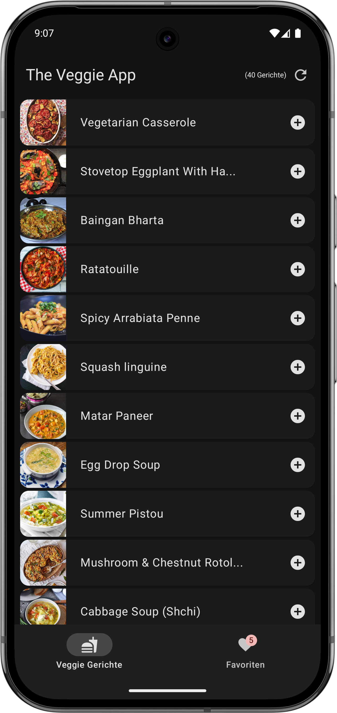

# TheVeggieApp

Welcome to **TheVeggieApp**! 🌱

This is an Android application designed to help you discover and save your favorite vegetarian meals. The app fetches a variety of delicious veggie recipes from an online API and lets you browse, explore, and mark your favorites for easy access later.

## Screenshots

## Features
- **Browse Veggie Meals:** Explore a curated list of vegetarian dishes, complete with images and names.
- **Save Favorites:** Mark meals you love as favorites and access them anytime in your personal favorites list.
- **Modern UI:** Built with Jetpack Compose for a smooth and modern user experience.
- **Refresh Recipes:** Instantly refresh the meal list to discover new dishes.

## How it Works
- The app fetches vegetarian meal data from [TheMealDB API](https://www.themealdb.com/api.php).
- You can scroll through the list, view meal images, and add meals to your favorites with a single tap.
- Your favorite meals are stored locally for quick access.

## Tech Stack
- **Kotlin** & **Jetpack Compose** for UI
- **MVVM Architecture**
- **Koin** for Dependency Injection
- **Room** for local data storage
- **Retrofit** & **Moshi** for network and JSON parsing

## Note from the Developer
> This project was created during my one-year training journey as a developer. It represents my learning progress and passion for building useful, user-friendly apps. One of my main intentions with this project was to learn about and apply modern app architecture principles in practice. If you have feedback or suggestions, feel free to reach out or open an issue. Thank you for checking out my work!

---

**Happy cooking and coding!** 🥦

---

*Developed by Fawwaz H.K.* 